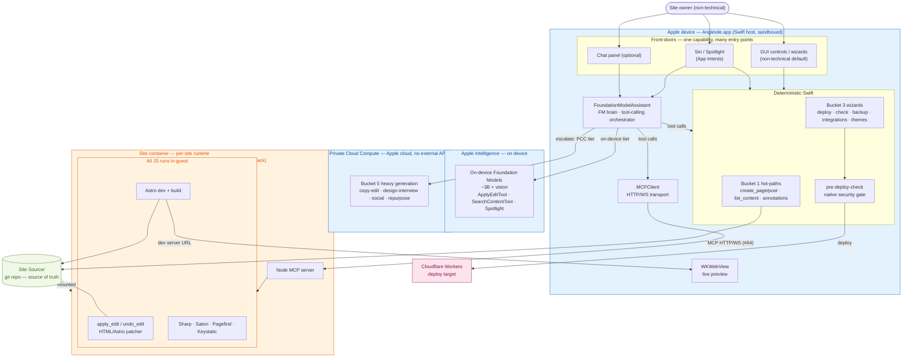

# Anglesite — Desired Application Architecture

The end-state after the [Claude Code removal roadmap](superpowers/specs/2026-06-20-claude-code-removal-roadmap-design.md):
no `claude` binary, deterministic Swift + Apple Intelligence only, and all JavaScript
running **inside the per-site container** rather than as a host-spawned process.

This diagram shows the trust / execution boundaries — what runs on the Apple device, what
runs in Apple's Private Cloud Compute, what runs inside the site container, and where the
filesystem source of truth and the deploy target sit.

## Boundaries

| Boundary | What's inside | How it's crossed |
|---|---|---|
| **Apple device (host)** | The Swift app: front-doors (GUI / Siri / chat), the `FoundationModelAssistant` orchestrator, deterministic Swift (Bucket 1 hot-paths + Bucket 3 wizards), the native `pre-deploy-check` gate, `MCPClient`, and the `WKWebView` preview. | User input; in-process Apple Intelligence API; `MCPClient` to the container. |
| **Apple Intelligence (on-device)** | The ~3B on-device Foundation Models + vision, with the registered FM `Tool`s (`ApplyEditTool`, `SearchContentTool`, Spotlight). | Called in-process by the FM brain; never leaves the device. |
| **Private Cloud Compute** | Heavy generation that exceeds the on-device ceiling (Bucket 5: copy-edit, design-interview, social, repurpose). Apple-operated; **no external LLM APIs ever**. | The FM brain escalates to the PCC tier over Apple's attested, encrypted channel. |
| **Site container (per-site)** | **All JavaScript**: the Node MCP server and everything it drives in-guest — `apply_edit`/`undo_edit` (HTML/Astro patcher), the Astro dev server + build, Sharp, Satori, Pagefind, Keystatic. Apple Containerization locally; Cloudflare Sandbox as the fallback on MAS / iOS / non-Apple-Silicon. | The host reaches it only over the in-container **MCP HTTP/WS transport** (#64) — not by host-spawning Node. |
| **Site `Source/` (git repo)** | The filesystem source of truth — the clonable, externally-editable unit. | Mounted into the container; written by the in-guest JS and by Swift Bucket-1 hot-paths; read by `WKWebView` via the dev server. |
| **Cloudflare (deploy target)** | The published site (Workers). | Deploy runs only after the native `pre-deploy-check` gate passes. |

## Notes

- **One capability, one implementation, many front-doors.** A GUI button, "Hey Siri…", and a
  chat request all call the same Swift function or in-container tool — never a second copy.
- **The security gate is unbypassable.** `pre-deploy-check` is native deterministic Swift,
  not an LLM hook, so it cannot be prompt-injected or talked out of running.
- **Interim vs end-state.** Until the container runtimes land (#66/#69/#70), the Node sidecar
  stays host-spawned and called directly, and the embedded host Node + JIT re-sign apparatus
  remains. The diagram shows the **end-state**: JS in-guest, host Node retired.
